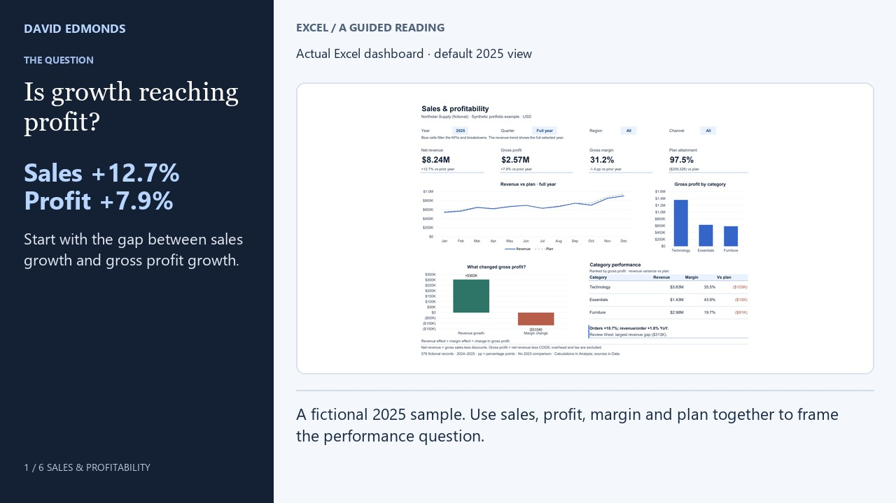

# David Edmonds — Data Analytics & BI Portfolio

A public, decision-focused portfolio for **David Edmonds**, a senior data analyst and BI professional specializing in Power BI, Tableau, SQL, Excel, KPI reporting, data quality, reporting improvement, and operational analytics.

**Live site:** [david-edmonds.github.io](https://david-edmonds.github.io/)

[One-page capability statement](public/david-edmonds-capability-statement.pdf) · [Report analyzer worked example](https://david-edmonds.github.io/tools/what-changed/#worked-example)

## Explore the work



| Project | Business question | Start here |
| --- | --- | --- |
| **Excel · Sales & Profitability** | Is higher revenue producing stronger profit? | [Watch the 72-second demo](https://david-edmonds.github.io/work/sales-profitability/#demo) · [Download project](https://david-edmonds.github.io/sales-profitability/sales-profitability-package.zip) · [Workbook guide](public/sales-profitability/README.md) |
| **SQL · Sales Investigation** | Which contributions reconcile to the change? | [Five queries and setup](public/sql-sales/README.md) · [Download project](https://david-edmonds.github.io/sql-sales/sql-sales-project.zip) |
| **Power BI · Federal Contracting** | How do obligations, competition and goal context compare? | [Case study and findings](https://david-edmonds.github.io/work/federal-contracting-performance/#key-findings) · [Review guide](project-docs/PROJECT_GUIDE.md#federal-contracting-performance) |
| **Tableau · Washington EV** | Where is the registered fleet concentrated? | [Snapshot findings](https://david-edmonds.github.io/work/washington-ev-market/#key-findings) · [Project repository](https://github.com/David-Edmonds/washington-ev-analytics) |

The Excel and SQL examples share **576 fictional records**. Federal and EV case studies use public-data portfolio evidence. None is presented as client work or proof of a realized business outcome.

**Two-minute review:** watch the demo, read the three linked findings, then open the workbook or run the SQL checks. [Project review guide](project-docs/PROJECT_GUIDE.md) explains the available evidence and limitations.

## What is included

- Washington EV Market Overview Tableau case study
- Federal Contracting Performance Power BI portfolio build
- Current Data Analytics Consultant role with Confia Solutions, LLC
- Sanitized defense analytics experience
- Reporting time and cost calculator
- Browser-only CSV quality checker
- Downloadable professional resume
- Multi-page responsive portfolio built with the ChatGPT Sites/Vinext stack

## Local development

Requires Node.js 22 or newer.

```bash
npm ci
npm run dev
```

Before opening a pull request:

```bash
npm run lint
npm test
```

`npm test` builds the Vinext application, tests the server-rendered pages, generates the complete static GitHub Pages export in `docs/`, validates every published route and root-relative link, and verifies the reviewed resume PDF by its exact SHA-256 checksum.

## Repository structure

```text
app/                  Source pages and components
app/tools/            Browser-based analytics tools
public/               Public images and reviewed resume PDF
scripts/              Deterministic GitHub Pages exporter
tests/                Rendered-page, static-release, truth, and privacy checks
docs/                 Generated GitHub Pages export
project-docs/AI_WORKFLOW.md   ChatGPT/Codex operating workflow
project-docs/ROADMAP.md       Prioritized product roadmap
AGENTS.md              Repository instructions for Codex and other agents
```

## Publishing rule

`app/` and `public/` are the source of truth. The `docs/` directory is generated output and must not be hand-edited.

After a reviewed change reaches `main`, the **Publish GitHub Pages export** workflow installs dependencies, lints the repository, audits production dependencies, runs the complete test/export suite, and commits only the generated `docs/` changes. The `docs/**` path exclusion prevents the generated publishing commit from creating a deployment loop.

## Truth and privacy rules

- Do not invent employers, clients, engagements, results, testimonials, or credentials.
- Approved current-role fact as of August 2026: Data Analytics Consultant with Confia Solutions, LLC, Remote, April 2025-Present. Do not imply full-time status or named end clients without explicit confirmation.
- Clearly label public-data and independent portfolio projects.
- Never commit client data, federal contract-sensitive information, classified material, protected health information, financial records, PII, credentials, API keys, or confidential source files.
- The CSV quality checker operates entirely in the visitor's browser. It does not upload or store the selected file.
- Only public, synthetic, or properly sanitized examples belong in this repository.

See [AGENTS.md](AGENTS.md) for the required AI-assisted development workflow.

## What Changed? Report Analyzer

The Analytics Lab links to `/tools/what-changed`, an independent browser-only CSV comparison tool. It includes synthetic sample reports, added/missing ID detection, duplicate-ID and exact-row checks, field changes, additive measure contributions, source-row inspection, and evidence/summary downloads. IDs are trimmed and case-sensitive. Duplicate groups are summed and flagged rather than silently paired or removed. Blank IDs and invalid measure values block comparison. No report contents are uploaded or persisted.

The engine tests are included in `npm test`; rendered/static tests verify the route, internal links, metadata, sample reconciliation and absence of upload/storage calls. The page's CSS is scoped to `.report-analyzer`. No new dependencies are required. Input limits are 5 MB and 50,000 records per CSV; one ID and one numeric measure are compared at a time. Contributions describe arithmetic rather than proven business causes.
