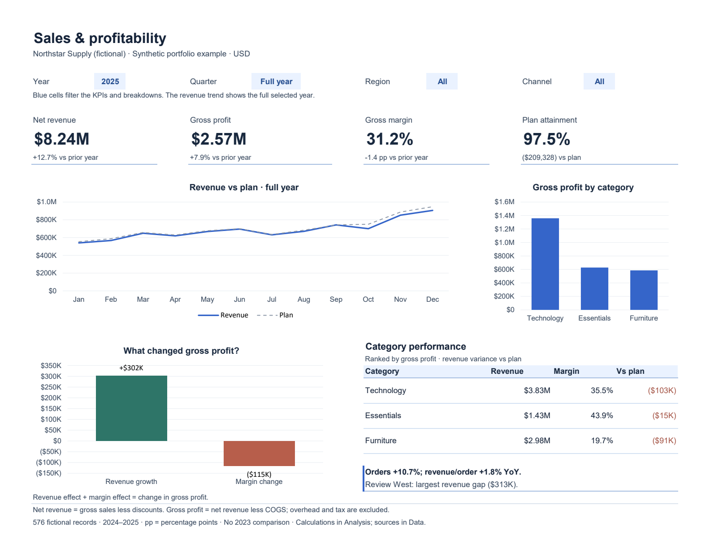

# Sales & profitability dashboard

An independent Excel portfolio example by David Edmonds. All Northstar Supply data is fictional; this is not client work or evidence of business results.

[Watch the 72-second demo](https://david-edmonds.github.io/work/sales-profitability/#demo) · [Download the complete project](https://david-edmonds.github.io/sales-profitability/sales-profitability-package.zip) · [Read key findings](https://david-edmonds.github.io/work/sales-profitability/#key-findings) · [Companion SQL](https://github.com/David-Edmonds/David-Edmonds.github.io/tree/main/public/sql-sales)

## A quick first pass

1. Open the workbook in **desktop Excel** with 2025 / Full year / All / All selected.
2. Compare revenue growth (12.7%) with gross profit growth (7.9%). Margin is 31.2%, down about 1.4 percentage points.
3. Change Quarter to Q3, Region to West and Channel to Online; inspect the changed KPIs, then reset the filters.
4. Open **Analysis** to inspect the reconciled profit contributions and **Data** to see the fictional source rows.

## Files in the download

| File | Purpose |
| --- | --- |
| `sales-profitability-dashboard.xlsx` | Working Excel dashboard, formulas and source table |
| `dashboard.pdf` / `dashboard.png` | Static full-year preview for quick review |
| `dashboard-demo.mp4` | 72-second captioned visual walkthrough; no audio |
| `demo-transcript.md` / `dashboard-demo.vtt` | Full transcript and optional captions |
| `walkthrough-filtered.png` | Reviewed Q3 / West / Online view |
| `demo-poster.jpg` | Video cover image |
| `README.md` | Setup, definitions, checks and limitations |

## Start here

Open `sales-profitability-dashboard.xlsx` in desktop Excel. The Dashboard opens with the complete 2025 sample. Choose the blue year, quarter, region and channel drop-downs to explore performance. The revenue trend always shows the selected full year; all other results use the selected quarter. Filtering the Data table does not filter the dashboard.

The PDF and PNG are static previews of the default selection. They do not update with workbook filters. No macros, sign-in or external data connections are needed.

## What the analysis explains

- Net revenue, gross profit, gross margin and revenue-plan attainment.
- Year-over-year growth and margin changes in percentage points (pp).
- Revenue growth split into order-count and revenue-per-order effects.
- Gross profit change split into revenue-growth and margin effects.
- Category performance and the largest regional revenue shortfall.

Dashboard presents the answer. Analysis contains calculations, driver definitions and reconciliation checks. Data contains 576 fictional monthly records covering 2024–2025, four regions, three categories and two channels.

## Interpretation

Net revenue = gross sales − discounts. Gross profit = net revenue − cost of goods sold; overhead, interest and tax are excluded. Gross margin = total gross profit / total net revenue. Plan attainment = net revenue / revenue plan.

Revenue order-count effect = change in orders × prior revenue per order. Revenue order-value effect = current orders × change in revenue per order. The effects sum to the net revenue change.

Profit revenue effect = change in net revenue × prior gross margin. Profit margin effect = current net revenue × change in gross margin. The effects sum to the gross profit change. These are arithmetic decompositions, not proof of business causes. Revenue per order combines pricing, discounts, basket size and category mix.

Comparisons use matching months, region and channel in the prior year. The sample has no 2023 data, so 2024 prior-year metrics are unavailable. An empty driver chart for 2024 is expected. Blank or invalid filters block headline values.

## Editing and limits

Use the existing source rows to try your own assumptions. To add rows or years, extend the bounded formula ranges in Analysis and the year validation list; this sample does not automatically expand its analysis ranges. Save a separate copy before replacing sample data. Do not publish confidential or personal data.

## Validation

Verified in desktop Microsoft Excel on September 8, 2026: three native charts; four drop-downs; source-edit recalculation; full-year and filtered-quarter totals; invalid-input handling; missing prior-year handling; independent checks of revenue and profit contributions; and one-page printing. No claim of compatibility testing in Google Sheets or LibreOffice is made.

The default fictional 2025 selection has $8,242,432.31 net revenue and $2,573,848.19 gross profit. Revenue growth contributes $302,455.59 to the gross profit change; margin change contributes −$115,095.05, reconciling to a $187,360.54 increase.
