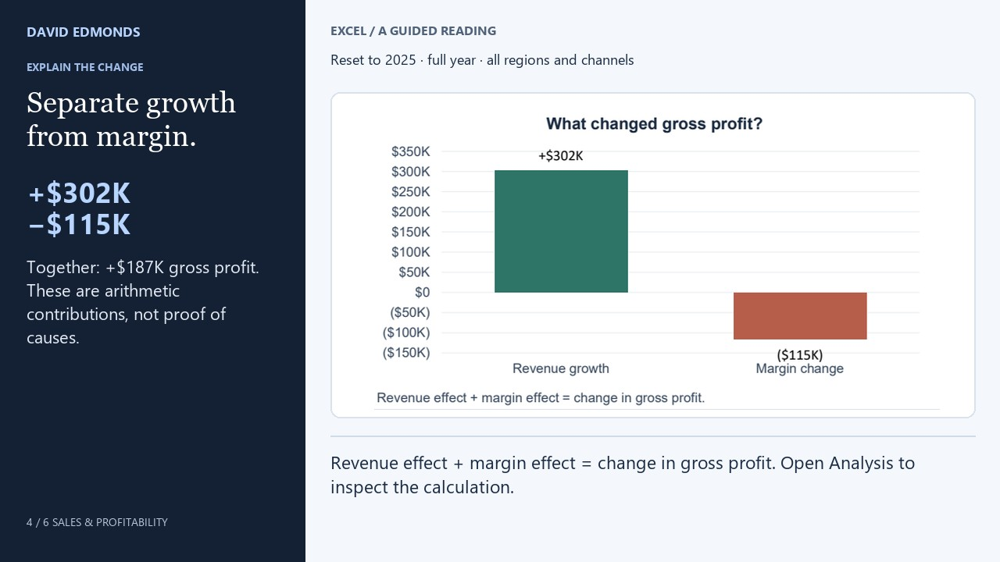

# Sales growth, profit pressure: a SQL investigation

Independent portfolio work by David Edmonds. Fictional Northstar Supply data; no client records or claimed business outcomes. This uses the exact 576 monthly facts from the accompanying Excel sales dashboard, with currency converted to integer USD cents.



[Read the case study](https://david-edmonds.github.io/work/sql-sales-investigation/) · [Download project](https://david-edmonds.github.io/sql-sales/sql-sales-project.zip) · [Watch the companion demo](https://david-edmonds.github.io/work/sales-profitability/#demo)

**Start without installing anything:** open [annual performance](results/01_performance.csv), [profit contributions](results/03_profit_drivers.csv), or [category pressure](results/04_category_pressure.csv). Each result has a corresponding numbered query in `queries/`.

## Project map

| File or folder | Purpose |
| --- | --- |
| `sales.csv` | 576 fictional records; currency fields use integer USD cents |
| `schema.sql` | SQLite table, constraints and annual view |
| `queries/` | Five numbered investigations with readable SQL |
| `run.py` | Loads an in-memory database and writes results |
| `validate.py` | Independently checks coverage, totals and reconciliations |
| `results/` | Ready-to-read CSV outputs and combined JSON |
| `preview.jpg` | Companion dashboard profit-contribution view |

## Run it

Extract the ZIP first, open a terminal in the extracted folder, and install Python 3.8 or newer with SQLite 3.25 or newer. No third-party Python packages, database server, account or network connection are needed.

```text
python run.py
python validate.py
```

Successful execution prints `Five investigations complete` followed by a `PASS` validation message. If Python is unavailable on Windows as `python`, try `py run.py` and `py validate.py`.

The runner creates an in-memory SQLite database, loads `sales.csv`, runs the five files in `queries/`, and writes CSV and JSON results to `results/`. Re-running replaces those result files. `schema.sql` defines the table, constraints and annual view. Downloaded results are already included for readers who do not want to execute code.

## Five questions

1. Is revenue growth translating into profit growth? Annual aggregation and `LAG` comparisons.
2. How much revenue growth comes from orders versus revenue per order? A reconciled two-part decomposition.
3. What offsets the profit contribution from revenue growth? Revenue and margin contributions.
4. Which category has the largest margin decline? Partitioned comparisons and weighted margins.
5. Where is the largest shortfall to plan? Regional grouping and ranking.

## Findings: fictional 2025 sample

- Revenue rose 12.7% to $8.24M; gross profit rose 7.9% to $2.57M.
- Orders increased 10.7%; revenue per order increased 1.8%.
- The revenue effect contributes $302,455.59 to profit, offset by a −$115,095.05 margin effect. Their sum is the $187,360.54 gross profit increase.
- Furniture margin fell about 4.0 percentage points to 19.7%, the largest category decline.
- West has the largest revenue shortfall, $312,710.96, against its plan. Regional shortfalls and overperformance net to the overall $209,327.65 shortfall.

## Interpret carefully

The unit of observation is month × region × category × channel, not an individual transaction or customer. Net revenue is gross sales less discounts. Gross profit also deducts COGS; overhead, interest and tax are excluded. The SQL investigations use complete calendar years; the Excel workbook additionally supports quarter, region and channel selections.

Ratios use aggregated numerators and denominators. Currency aggregates use integer cents before conversion to dollars; ratios and contributions use floating-point arithmetic with reconciliation tolerance. No 2023 records exist, so 2024 prior-year outputs are NULL (blank in CSV), never silently zero. NULLIF prevents division by zero.

These decompositions explain arithmetic contributions, not business causes. Revenue per order includes price, discount, basket and category mix. Within-category margin effects in question 4 exclude category revenue-mix shifts; do not sum them and equate that sum with the aggregate margin effect in question 3. Investigate pricing, discount policies, product mix and cost inputs before recommending interventions.

## Validation

`validate.py` checks full expected source coverage, unique grain, independent source totals, reviewed Excel anchors, weighted margins, revenue and profit reconciliation, missing comparisons, regional totals, rejection of duplicates, and rejection of discounts larger than gross sales. It uses assertions and must run without Python's `-O` option.

Public portfolio: https://david-edmonds.github.io/work/sql-sales-investigation/
Excel dashboard: https://david-edmonds.github.io/work/sales-profitability/
