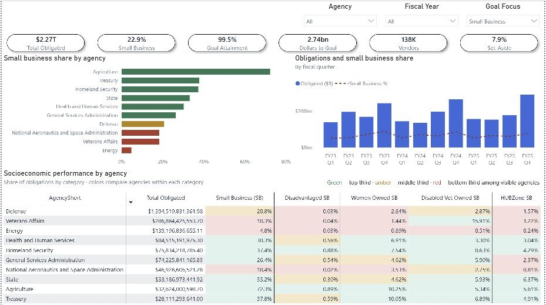
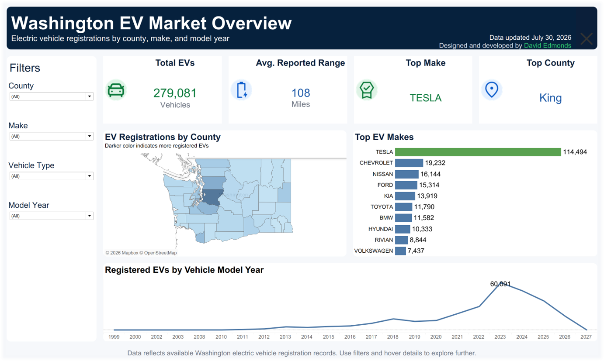

# A reviewer’s guide to the portfolio

Use the [live Work page](https://david-edmonds.github.io/work/) to browse, then follow the evidence associated with the question you want to assess. All projects are independent portfolio work.

## Sales and profitability: Excel + SQL

**Question:** Is sales growth translating into stronger profit?

- [Watch the demo](https://david-edmonds.github.io/work/sales-profitability/#demo), then inspect [three findings and their evidence](https://david-edmonds.github.io/work/sales-profitability/#key-findings).
- [Download Excel project](https://david-edmonds.github.io/sales-profitability/sales-profitability-package.zip) or follow the [workbook guide](../public/sales-profitability/README.md).
- [Download SQL project](https://david-edmonds.github.io/sql-sales/sql-sales-project.zip) or follow the [SQL setup](../public/sql-sales/README.md).
- Evidence: fictional monthly records, formulas, SQL queries, result tables and independent validation. The workbook and SQL use the same source.
- Limit: arithmetic contributions explain the numerical change; they do not establish a causal business explanation. Gross profit excludes overhead, interest and tax.

## Federal Contracting Performance

**Question:** How do modeled obligations, competition and small-business participation vary, and what constitutes a valid goal comparison?

- [Read the case study](https://david-edmonds.github.io/work/federal-contracting-performance/) and [three key findings](https://david-edmonds.github.io/work/federal-contracting-performance/#key-findings).
- Review the published FY2023–FY2025 totals: $746.4B, $740.9B and $778.4B respectively.
- Inspect the distinction between total modeled obligations and eligible dollars used for goal attainment. Match goals by agency, fiscal year and category.
- Available evidence: sanitized dashboard image, model description, validated aggregate findings and interpretation notes.
- Availability limit: the model file and underlying row-level source are not distributed in this repository. Readers can assess the published evidence but cannot rerun that model from this package.

## Washington EV Market Overview

**Question:** How is the registered EV fleet distributed across counties, manufacturers and model years?

- [Open the case study](https://david-edmonds.github.io/work/washington-ev-market/) or [explore the original project repository](https://github.com/David-Edmonds/washington-ev-analytics).
- Clear filters in the interactive dashboard, then choose a county, make or vehicle type to compare segments.
- Findings on the portfolio refer to the published image labeled July 30, 2026: 279,081 vehicles; Tesla 114,494; King is the leading county; model year 2023 contains 60,091 vehicles.
- Tesla’s displayed share is 114,494 / 279,081, rounded to 41.0%. The live dashboard may use a later snapshot.
- Limits: registration counts are not population-adjusted adoption rates. Model year is not registration year. Missing and zero ranges are excluded from the average-range measure, not from vehicle counts.

## How to assess the work

1. Identify the question, scope and unit of observation.
2. Follow each finding to the query, table or snapshot supporting it.
3. Check which comparisons use the same filters and denominator.
4. Separate measured contributions from proposed next investigations.
5. Use the linked setup instructions to reproduce the projects where source files are distributed.
